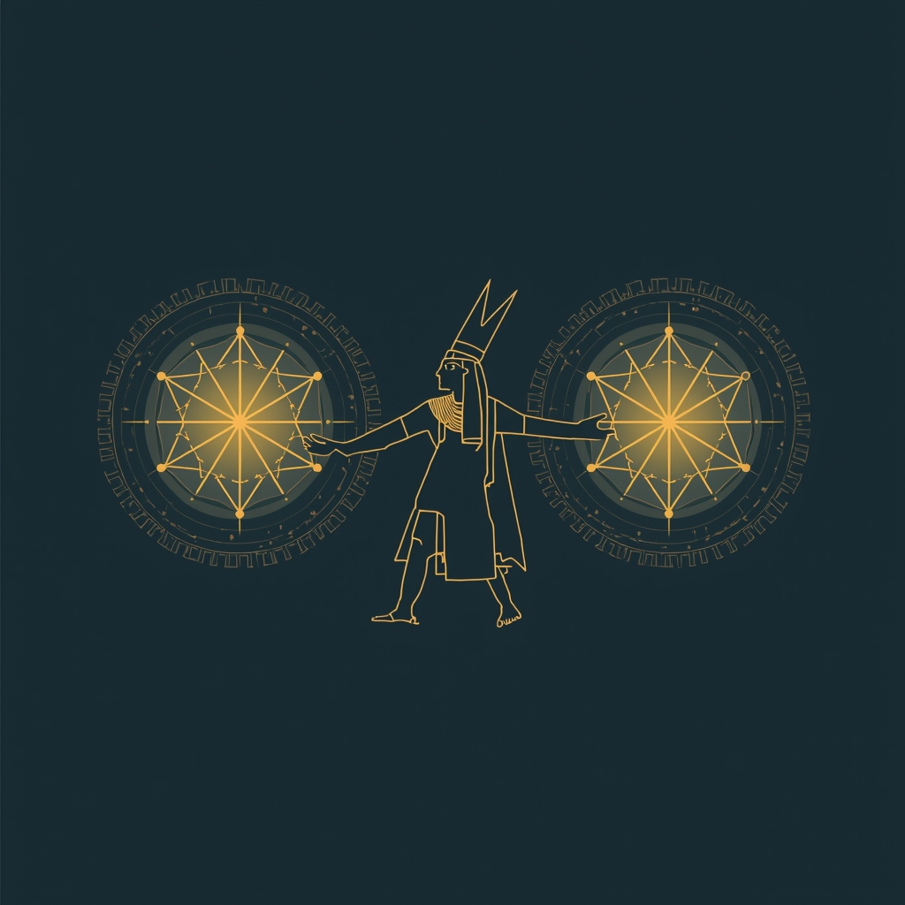

# Enki

My personal AI assistant. Named after the Sumerian god of knowledge, crafts, and creation.

Runs on Claude, lives in Telegram, can touch code. Personal project built for my own use — opinionated, tailored to my setup, shared publicly in case it's useful to anyone. Not a framework, not a platform.

---

## What it does

Talks to me on Telegram. Manages tasks, searches the web, reads my calendar and email. Runs scheduled briefings. Can spawn Claude Code to work on external codebases and report back.

---

## Stack

- Python 3.12, Claude API, Telegram bot
- SQLite for everything persistent (memory, tasks, audit, teams, schedule)
- Claude Code CLI for code generation
- Docker + LaunchAgent for always-on deployment on my Mac

---

## License

MIT
